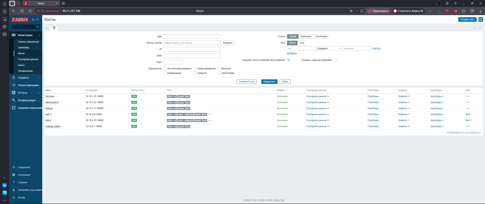
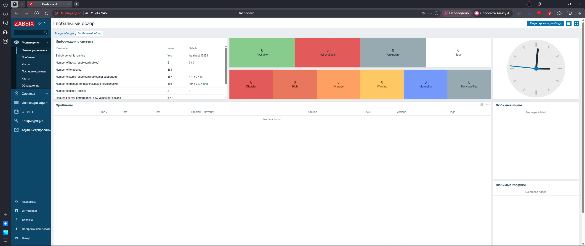
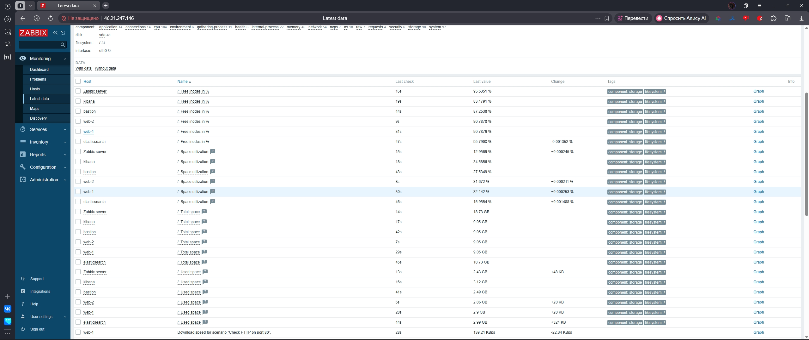
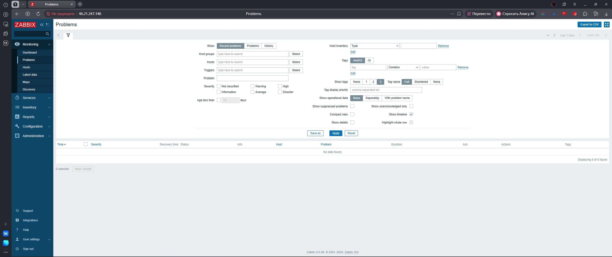
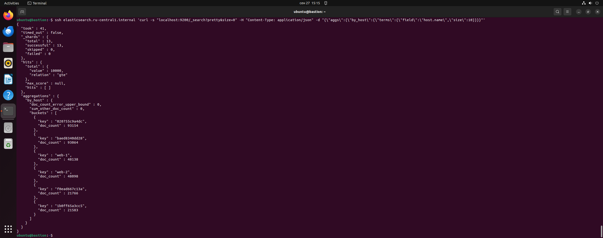
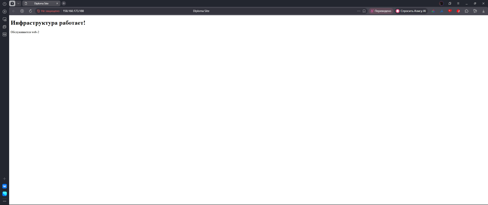
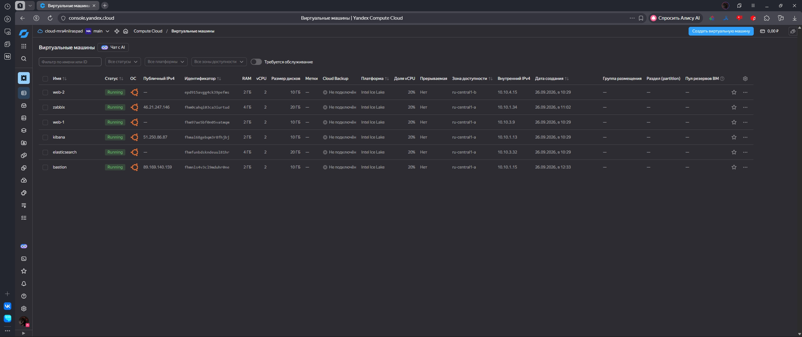

# Диплом: Облачная инфраструктура мониторинга и логирования

**Статус:** ✅ Полностью рабочая инфраструктура в Yandex Cloud.

## Архитектура

Проект реализует отказоустойчивый стек мониторинга и логирования на базе Yandex Cloud:

* **Compute Cloud:** 6 виртуальных машин (web-1, web-2, zabbix, kibana, elasticsearch, bastion).
* **Мониторинг (Zabbix):** Сбор метрик ОС, сети, диска. Реализован USE-подход (Utilization, Saturation, Errors).
* **Логирование (ELK):** Filebeat → Elasticsearch → Kibana.
* **Балансировка:** Yandex Application Load Balancer (ALB) для веб-серверов.

## Доказательства работоспособности

Все доказательства собраны в папке [docs/screenshots](docs/screenshots).

| Скриншот | Статус | Что доказывает |
| :--- | :---: | :--- |
| `hosts_zabbix.png` | ✅ | Zabbix видит все 6 хостов, агенты работают. |
| `use_dashboard.png` | ✅ | Графики CPU, RAM и сети в норме (нет пиков). |
| `latest_data.png` | ✅ | Метрики собираются в режиме реального времени. |
| `problems_empty.png` | ✅ | Критических сбоев нет (список проблем пуст). |
| `es_curl_logs.png` | ✅ | Логи с web-1 и web-2 попадают в Elasticsearch. |
| `alb_site.png` | ✅ | ALB балансирует трафик, сайт доступен. |
| `yc_vms_list.png` | ✅ | Все ВМ в статусе RUNNING в Yandex Cloud. |

## Как развернуть (Terraform)

Инфраструктура управляется через Terraform.

1. Инициализация: `terraform init`
2. План изменений: `terraform plan`
3. Применение: `terraform apply`

> **Примечание:** В текущей конфигурации используются `preemptible = true` для экономии средств на этапе тестирования. Для продакшена необходимо изменить значение на `false`.

## Файлы проекта

* `main.tf`: Описание ресурсов (ВМ, сети, балансировщик).
* `docs/screenshots`: Скриншоты для диплома.
* `docs/README.md`: Подробное описание каждого скриншота и тексты для пояснительной записки.

## Доказательства реализации (скриншоты)

Ниже приведены скриншоты, подтверждающие выполнение ключевых требований технического задания.

### 1. Мониторинг инфраструктуры (Zabbix)

**hosts_zabbix.png** — в Zabbix добавлены и отслеживаются все узлы инфраструктуры (web‑1, web‑2, zabbix, kibana, elasticsearch, bastion).  

**use_dashboard.png** — настроен USE‑дашборд (Utilization, Saturation, Errors) для оценки производительности CPU, RAM и сетевой нагрузки.  

**latest_data.png** — отображение актуальных метрик в режиме реального времени.  

**problems_empty.png** — отсутствие активных проблем и алертов, что подтверждает стабильность работы системы на момент демонстрации.  

### 2. Сбор и агрегация логов (ELK)

**es_curl_logs.png** — проверка наличия и структуры логов в Elasticsearch через curl. Подтверждает, что сбор логов с узлов работает, данные индексируются и доступны для поиска.  

### 3. Доступность приложения и балансировка нагрузки

**alb_site.png** — успешное обращение к приложению через Application Load Balancer (ALB). Ответ «Инфраструктура работает!» и указание на бэкенд (web‑2) доказывают корректную работу балансировщика и веб‑серверов.  

### 4. Инфраструктура в Yandex Cloud

**yc_vms_list.png** — список виртуальных машин в консоли Yandex Compute Cloud. Все 6 узлов находятся в статусе `Running`, параметры (vCPU, RAM, диски) соответствуют конфигурации Terraform.  

